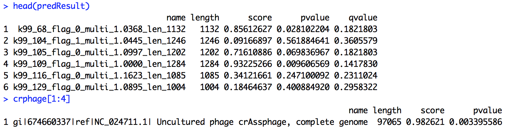

# VirFinder: R package for identifying viral sequences from metagenomic data using sequence signatures
Version: 1.1

Authors: Jie Ren, Nathan Ahlgren, Yang Lu, Jed Fuhrman, Fengzhu Sun

Maintainer: Jie Ren <renj@usc.edu>

Description
----------------

The package provides functions to predict viral sequences in a fasta file, such as the assembled contigs from metagenomic data. The method has good prediction accuracy for short (~1kb) and noval viral sequences.

The prediction method is based on the sequence signatures (k-tuple word frequencies) that distinguish virus from host sequences. The model was trained using equal number of known viral and host sequences. For a query sequence, the number of occurrences of k-tuple words are first counted by a c++ program using a hash table. Then the sequence is predicted based on the k-tuple word frequencies using a logistic regression model trained with previously known sequences.

Dependencies
---------------
R packages "glmnet", "Rcpp" and "qvalue" are needed to be installed before Installation of VirFinder.

To install "glmnet" and "Rcpp", start R and enter,
	
	install.packages("glmnet", dependencies=TRUE)
	install.packages("Rcpp", dependencies=TRUE)
  
  
To install "qvalue", start R and enter,

	## try http:// if https:// URLs are not supported; it also checks for out-of-date packages
	source("https://bioconductor.org/biocLite.R")
	biocLite("qvalue")

Installation
---------------
To install the R package VirFinder, follow the instuctions on http://cran.r-project.org/doc/manuals/r-release/R-admin.html#Installing-packages.

To quick start, first download the package file VirFinder_1.0.tar.gz or VirFinder_1.0.zip according to your operating system.

For Mac/Linux users, if you have a Graphic User Interfaces (GUI) of R, you fire up a R graphic window and type, 

	install.packages("<path_to_the_file>/VirFinder_1.0.tar.gz", repos = NULL, type="source")
  library(VirFinder)

If you are not using GUI of R, you can install the package from the command line. Simply type the following to the command line,

	R CMD INSTALL <path_to_the_file>/VirFinder_1.0.tar.gz

For Windows users, if you have a Graphic User Interfaces (GUI) of R, you first fire up a R graphic window. 
You can click "Install packages(s) from local files...", and choose the file VirFinder_1.0.zip. 
Or you can type, 

	install.packages("<path_to_the_file>/VirFinder_1.0.zip", repos = NULL, type="source")
	library(VirFinder)

If you are not using GUI of R, you can install the package from the command line. Simply type the following to the command line,

	Rcmd INSTALL <path_to_the_file>\VirFinder_1.0.zip
  

Usage
---------  
Please refer to VirFinder-manual.pdf for usage instruction.

To quick start, one can predict the viral contigs using the command,
   
    library(VirFinder)
    predResult <- VF.pred(<path_to_the_fasta_file>)
    
    
As an example, the package provides a small testing data containing 30 contigs, 

    ## (1) set the input fasta file name. 
    library(VirFinder)
    inFaFile <- system.file("data", "contigs.fa", package="VirFinder")
    
    ## (2) prediction
    predResult <- VF.pred(inFaFile)
    predResult
    
    #### (2.1) sort sequences by p-value in ascending order
    predResult[order(predResult$pvalue),]
    
    #### (2.2) estimate q-values (false discovery rates) based on p-values
    predResult$qvalue <- VF.qvalue(predResult$pvalue)
    
    #### (2.3) sort sequences by q-value in ascending order
    predResult[order(predResult$qvalue),]
    
The package also has the reference sequence of crAssphage for users to test, 

    inFaFile <- system.file("data", "crAssphage.fasta", package="VirFinder")
    VF.pred(inFaFile)

The result will be something like the following. Each row represents a contig/sequences, 
with name, length, score, p-value and q-value. The higher score or lower p-value 
indicate higher likelihood of being a viral sequence. 
The q-value measures the proportion of false positives incurring
when predicting viral sequences using the corresponding p-value as a threshold.

  

Training the model using users' database
--------- 
A new function has been added to the package to allow users to train the prediction model 
using their own database for viral sequences and host sequences. 

To start with, two fasta formated files, containing viral sequences and host sequences respectively, need to be specified. 
The directory where the file of the trained model will be saved and the name of the model need to be set as well.

    ## (1) specifiy the fasta files of the training contigs
    #### (1.1) one for virus and one for prokaryotic hosts
    trainFaFileHost <- system.file("data", "tara_host.fa", package="VirFinder")
    trainFaFileVirus <- system.file("data", "tara_virus.fa", package="VirFinder")

    #### (1.2) specify the directory where the trained model will be saved, and the name of the model
    userModDir <- file.path(find.package("VirFinder"))
    userModName <- "modTara"
    
The input sequences are then fragmented into fixed lengths of 0.5 kb, 1kb and 3kb. 
The k-tuple frequencies are counted for each fragments. 
The length of the k-tuple need to be specified.
The longer k-tuple can describe better the difference between virus and host sequences, 
but if the data is not enough, it can lead to an overfitting problem. 
Given the database, users are suggested to test different lengths of k-tuple in order to get the best model.

Three different models are trained based on the k-tuple frequencies of viral and host fragments of three different lengths.
The models are used for prediction of sequences of different lengths. 
For query sequences of length < 1 kb, the model trained using 0.5 kb fragments is used for predicting.
For sequences of length ranging from 1 kb to 3 kb, the model trained using 1 kb fragments is used, 
and for sequences > 3 kb, the model trained using 3 kb fragments is used for prediction. 

    ## (2) train the model using user's database
    w <- 6  # the length of the k-tuple word
    VF.trainModUser <- VF.train.user(trainFaFileHost, trainFaFileVirus, userModDir, userModName, w)

Once the trained model is returned, it can be used to predict viral sequences. 
Here we use the same example, the small testing data containing 30 contigs, for illustrate the usage.

    ## (3) predict the contigs using the customized model
    #### (3.1) specify the fasta file containing contigs for prediction
    inFaFile <- system.file("data", "contigs.fa", package="VirFinder")

    #### (3.2) prediction
    predResultUser <- VF.pred.user(inFaFile, VF.trainModUser)
    predResultUser

    #### (3.3) sort sequences by p-value in ascending order
    predResultUser[order(predResultUser$pvalue),]

Copyright and License Information
-----------------------------------

Copyright (C) 2017 University of Southern California, Jie Ren

Authors: Jie Ren, Nathan Ahlgren, Yang Lu, Jed Fuhrman, Fengzhu Sun

This program is free software: you can redistribute it and/or modify it under the terms of the GNU General Public License as published by the Free Software Foundation, either version 3 of the License, or (at your option) any later version.

This program is distributed in the hope that it will be useful, but WITHOUT ANY WARRANTY; without even the implied warranty of MERCHANTABILITY or FITNESS FOR A PARTICULAR PURPOSE. See the GNU General Public License for more details.

You should have received a copy of the GNU General Public License along with this program. If not, see http://www.gnu.org/licenses/.

