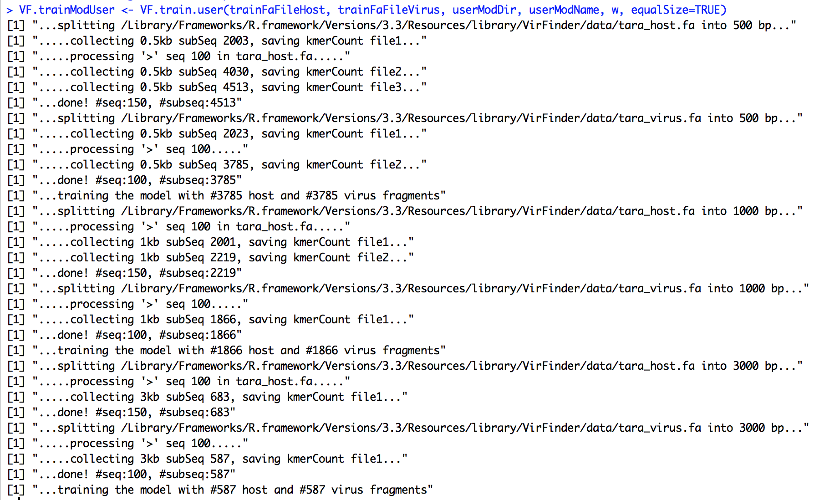
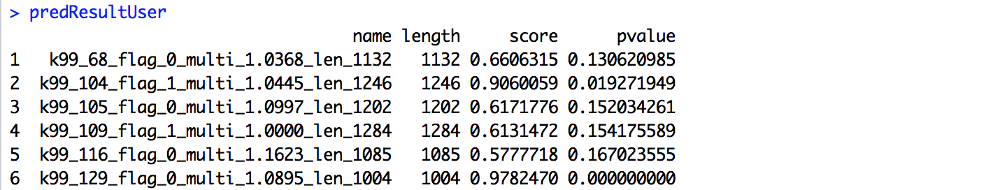
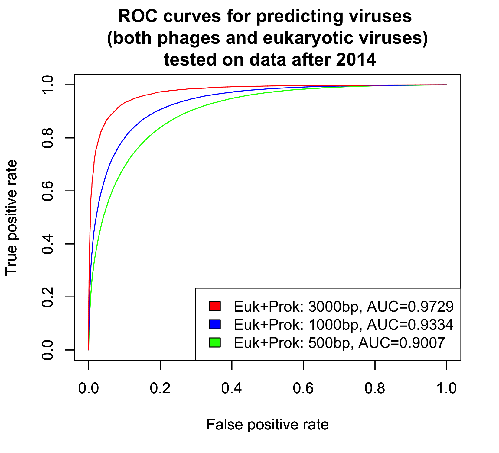
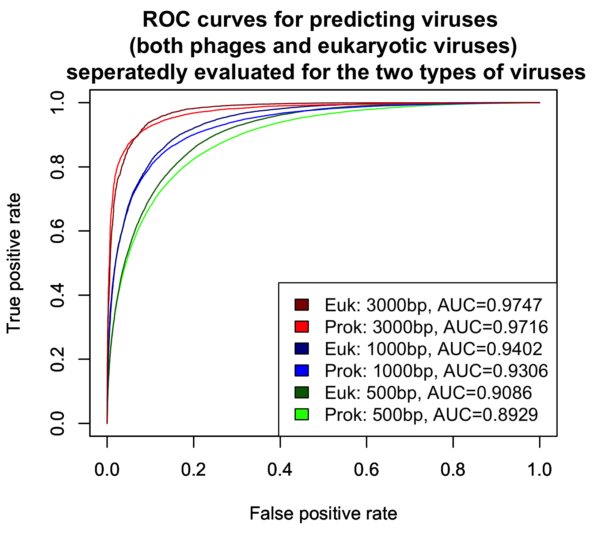

# VirFinder: R package for identifying viral sequences from metagenomic data using sequence signatures
Version: 1.1

Authors: Jie Ren, Nathan Ahlgren, Yang Lu, Jed Fuhrman, Fengzhu Sun

Maintainer: Jie Ren <renj@usc.edu>

Description
----------------

The package provides functions to predict viral sequences in a fasta file, such as the assembled contigs from metagenomic data. The method has good prediction accuracy for short (~1kb) and noval viral sequences.

The prediction method is based on the sequence signatures (k-tuple word frequencies) that distinguish virus from host sequences. The model was trained using equal number of known viral and host sequences. For a query sequence, the number of occurrences of k-tuple words are first counted by a c++ program using a hash table. Then the sequence is predicted based on the k-tuple word frequencies using a logistic regression model trained with previously known sequences.

Dependencies
---------------
R packages "glmnet", "Rcpp" and "qvalue" are needed to be installed before Installation of VirFinder.

To install "glmnet" and "Rcpp", start R and enter,
	
	install.packages("glmnet", dependencies=TRUE)
	install.packages("Rcpp", dependencies=TRUE)
  
  
To install "qvalue", start R and enter,

	## try http:// if https:// URLs are not supported; it also checks for out-of-date packages
	source("https://bioconductor.org/biocLite.R")
	biocLite("qvalue")

Installation
---------------
To install the R package VirFinder, follow the instuctions on http://cran.r-project.org/doc/manuals/r-release/R-admin.html#Installing-packages.

To quick start, first download the package file VirFinder_1.1.tar.gz or VirFinder_1.1.zip according to your operating system.

For Mac/Linux users, if you have a Graphic User Interfaces (GUI) of R, you fire up a R graphic window and type, 

    install.packages("<path_to_the_file>/VirFinder_1.1.tar.gz", repos = NULL, type="source")  
    library(VirFinder)

If you are not using GUI of R, you can install the package from the command line. Simply type the following to the command line,

	R CMD INSTALL <path_to_the_file>/VirFinder_1.1.tar.gz

For Windows users, if you have a Graphic User Interfaces (GUI) of R, you first fire up a R graphic window. 
You can click "Install packages(s) from local files...", and choose the file VirFinder_1.1.zip. 
Or you can type, 

	install.packages("<path_to_the_file>/VirFinder_1.1.zip", repos = NULL, type="source")
	library(VirFinder)

If you are not using GUI of R, you can install the package from the command line. Simply type the following to the command line,

	Rcmd INSTALL <path_to_the_file>\VirFinder_1.1.zip
  
VirFinder is also avaiable on [Anaconda](https://anaconda.org/bioconda/r-virfinder). Thanks William L. Close, Ph.D. (wlclose@med.umich.edu) for the efforts!

Usage
---------  
Please refer to VirFinder-manual.pdf for usage instruction.

To quick start, one can predict the viral contigs using the command,
   
    library(VirFinder)
    predResult <- VF.pred(<path_to_the_fasta_file>)
    
    
As an example, the package provides a small testing data containing 30 metagenomically assembled contigs, 

    ## (1) set the input fasta file name. 
    library(VirFinder)
    inFaFile <- system.file("data", "contigs.fa", package="VirFinder")
    
    ## (2) prediction
    predResult <- VF.pred(inFaFile)
    predResult
    
    #### (2.1) sort sequences by p-value in ascending order
    predResult[order(predResult$pvalue),]
    
    #### (2.2) estimate q-values (false discovery rates) based on p-values
    predResult$qvalue <- VF.qvalue(predResult$pvalue)
    
    #### (2.3) sort sequences by q-value in ascending order
    predResult[order(predResult$qvalue),]
    
The package also has the reference sequence of crAssphage for users to test, 

    inFaFile <- system.file("data", "crAssphage.fasta", package="VirFinder")
    VF.pred(inFaFile)

The result will be something like the following. Each row represents a contig/sequences, 
with name, length, score, p-value and q-value. The higher score or lower p-value 
indicate higher likelihood of being a viral sequence. 
The q-value measures the proportion of false positives incurring
when predicting viral sequences using the corresponding p-value as a threshold.

  

Training models using users' database
--------- 
A new function has been added to the package to allow users to train the prediction model 
using their own database for viral sequences and host sequences. 

To start with, two fasta formated files, containing viral sequences and host sequences respectively, need to be specified. 
The directory where the file of the trained model will be saved and the name of the model need to be set as well.

    ## (1) specifiy the fasta files of the training contigs
    #### (1.1) one for virus and one for prokaryotic hosts
    trainFaFileHost <- system.file("data", "tara_host.fa", package="VirFinder")
    trainFaFileVirus <- system.file("data", "tara_virus.fa", package="VirFinder")

    #### (1.2) specify the directory where the trained model will be saved, and the name of the model
    userModDir <- file.path(find.package("VirFinder"))
    userModName <- "modTara"
    
The input sequences are then split into non-overlapping fragments of fixed lengths of 0.5 kb, 1kb and 3kb. 
The k-tuple frequencies are counted for each fragments. 
The length of the k-tuple need to be specified.
The longer k-tuple can describe better the difference between virus and host sequences, 
but if the data is not enough, it can lead to an overfitting problem. 
Given the database, users are suggested to test different lengths of k-tuple in order to get the best model.

Three different models are trained based on the k-tuple frequencies of viral and host fragments of three different lengths.
User can specify if equal numbers of virus and host fragments are used for training by setting equalSize=TRUE. 
The default model is FALSE.
The models are used for prediction of sequences of different lengths. 
For query sequences of length < 1 kb, the model trained using 0.5 kb fragments is used for predicting.
For sequences of length ranging from 1 kb to 3 kb, the model trained using 1 kb fragments is used, 
and for sequences > 3 kb, the model trained using 3 kb fragments is used for prediction. 

    ## (2) train the model using user's database
    w <- 4  # the length of the k-tuple word
    VF.trainModUser <- VF.train.user(trainFaFileHost, trainFaFileVirus, userModDir, userModName, w, equalSize=TRUE)

Collecting fragments and training the model may take some time. 
#Roughly, it takes 1 min to collect 100 contigs and count 8-mer frequencies. 
Decreasing kmer length can exponentially reduce the computing time. 
The screen output for the training process will be something like the following,

  

Once the trained model is returned, it can be used to predict viral sequences. 
Here we use the same example, the small testing data containing 30 contigs, for illustrate the usage.

    ## (3) predict the contigs using the customized model
    #### (3.1) specify the fasta file containing contigs for prediction
    inFaFile <- system.file("data", "contigs.fa", package="VirFinder")

    #### (3.2) prediction
    predResultUser <- VF.pred.user(inFaFile, VF.trainModUser)
    predResultUser

    #### (3.3) sort sequences by p-value in ascending order
    predResultUser[order(predResultUser$pvalue),]

The predict scores will be something like the following,

  

VirFinder model for predicting prokaryotic phages and eukaryotic viruses 
--------- 
VirFinder was originally designed for detecting bacterial and archaeal viruses in metagenomic data. 
Although metagenomic samples are mostly composed by prokaryotes and prokaryotic viruses, 
it is possible that a few eukaryotic viruses that infecting human or other eukaryotic species can be found in the data.
VirFinder provides the functions "VF.train.user" and "VF.pred.user" that allow users to easily train new classification models using their own database.
With the help of Dr. Osnat Tirosh, we collected about 5800 human, plants and invertebrates eukaryotic viruses from NCBI. 
Those eukaryotic viruses were split into non-overlapping fragments of various lengths, 500, 1000, 3000 bp, for training and testing. 
Following the same procedure in the paper, we used the contigs before 2014 for training and contigs after 2014 for testing. 
The number of the contigs for eukaryotic viruses are shown in the following table:

| number of eukaryotic virus contigs  | Before 1 January 2014  | After 1 January 2014  | Total 
| ------------- |:-------------:| -----:| -----:
| 500 bp        |  54,458        | 40,542 |  95,000
| 1000 bp       |  26,820        | 19,558 |  46,378
| 3000 bp       |  8,083         | 5,665  |  13,748

We trained the VirFinder using the positive set containing all the previously prokaryotic contigs plus the newly collected eukaryotic contigs, 
and the negative set containing the same number of bacteria host contigs. 
Three models were trained: a model for predicting contigs of 500-1000 bp, a model for predicting contigs of 1000-3000 bp, and a model for contigs > 3000 bp.
We evaluated the prediction performance of the new models at the three different contig lengths. 
The AUC scores (area under the ROC curve) for the new models are similar to those for the original model in the paper.
The eukaryotic viruses and prokaryotic viruses both have high AUC scores around 0.97 for 3000 bp contigs, 0.93 for 1000 bp contigs, and 0.90 for 500 bp contigs. 
Eukaryotic viruses have a slight better performance than prokaryotic viruses, but the difference is very small. 
See the following figures for the details:

   
  

The newly trained model for predicting both prokaryotic and eukaryotic viruses can be downloaded from [here](https://github.com/jessieren/VirFinder/raw/master/EPV/VF.modEPV_k8.rda).
To use, first specify the directory of the model file "VF.modEPV_k8.rda" and load the model into R workspace. 
second, use the function "VF.pred.user(inFaFile, modEPV)" to predict the contigs in the input fasta file.

    ## specify the directory of the new model file "VF.modEPV_k8.rda", and load the new model to the work space
    modFile <- "<path_to_the_model_file>/VF.modEPV_k8.rda"
    load(modFile)
    
    ## specify the fasta file containing contigs for prediction
    #inFaFile <- "<path_to_the_input_fasta_file>/input.fasta"
    inFaFile <- system.file("data", "crAssphage.fasta", package="VirFinder")
    
    ## predict the contigs using the new model
    predResultUser <- VF.pred.user(inFaFile, modEPV)
    
    
For example, the score for crAssphage predicted by the new model is 0.9564 with p-value 0.0055, where the score predicted by the original model is 0.9826 with p-value 0.0034.
It suggests that the new model and the original model provide very similar prediction scores for the same prokaryotic viral sequence. 
In fact, the Pearson correlation between the predicted scores for the prokaryotic viral sequences after 2014 using the new model and that using the original model is 0.8766. 
The Spearman correlation is similar 0.8797.
Similarily, the Pearson and Spearman corrlation scores for the prokaryotic host sequences after 2014 between the new model and the original model are 0.8752 and 0.8896.

Therefore, the new model is consistent with the original model in predicting the prokaryotic virus and prokaryotic host sequences.
The new model has higher accuracy for predicting eukaryotic viruses. 

<!--An interesting question is whether the original VirFinder model (trained using only prokaryotic viruses) can be used to predict the eukaryotic viruses? -->
<!--If yes, how well the model performs? -->
<!--If the original model for prokaryotic viruse also works well for predicting eukaryotic viruses, then it indicates that both types of viruses share similar k-mer patterns.-->
<!--The AUC scores for predicting eukaryotic viral contigs using the original VirFinder model is 0.80 for 500 bp contigs, 0.82 for 1000 bp contigs, and 0.87 for -->
<!---->

Remarks
------------------
1. Users applying VirFinder to eukaryotic host associated microbiomes should take caution in filtering out eukaryotic sequences,
 as VirFinder may potentially mis-identify those sequences as viral, since eukaryotic sequences were not included in VirFinder’s training datasets.

2. VF.qvalue uses the existing function "qvalue" in the R package "qvalue" (Bass JDSwcfAJ, Dabney A and Robinson D (2015)) to estimate q-values given p-values. 
For some p-value distributions, VF.qvalue may prompt the error as "The estimated pi0 <= 0. Check that you have valid p-values or use a different range of lambda.".
The error may also come up when the p-values are not fully covering the whole interval [0,1] or when there is a lack of p-values close or equal to 1.
One possible case that leads to the above scenario is there are not enough bacteria contigs in the data such that the proportion of bacteria contigs cannot be estimated.

3. VirFinder can be run in parallel using multiple cores. See script [here](https://github.com/rec3141/VirFinder/blob/master/linux/VirFinder/R/parVF.pred.R). Thanks for the contributions from R. Eric Collins.

Reference and Citation
----------------------

If you use VirFinder, please cite the following paper:

[Jie Ren, Nathan A. Ahlgren, Yang Young Lu, Jed A. Fuhrman and Fengzhu Sun. VirFinder: a novel k-mer based tool foridentifying viral sequences from assembled metagenomic data. *Microbiome* (2017) 5:69 ](https://link.springer.com/epdf/10.1186/s40168-017-0283-5?author_access_token=YQgkTWibFIFPtRICkTjZF2_BpE1tBhCbnbw3BuzI2RMCpVMGldKV8DA9scozc7Z-db3ufPFz9-pswHsYVHyEsCrziBuECllLPOgZ6ANHsMeKF5KejrdDKdeASyDkxB5wfFDq523QSd01cnqxCLqCiQ%3D%3D)

Copyright and License Information
-----------------------------------

Copyright (C) 2017 University of Southern California

Authors: Jie Ren, Nathan Ahlgren, Yang Lu, Jed Fuhrman, Fengzhu Sun

This program is freely available as an R package at https://github.com/jessieren/VirFinder under the terms of USC-RL v1.0. 

Commercial users should contact Dr. Sun at fsun@usc.edu, copyright at the University of Southern California. 

This program is distributed in the hope that it will be useful, but WITHOUT ANY WARRANTY; without even the implied warranty of MERCHANTABILITY or FITNESS FOR A PARTICULAR PURPOSE. See the GNU General Public License for more details.

<!--You should have received a copy of the GNU General Public License along with this program. If not, see http://www.gnu.org/licenses/.-->

